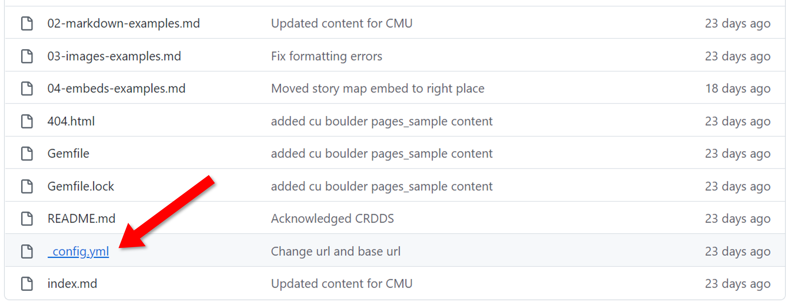
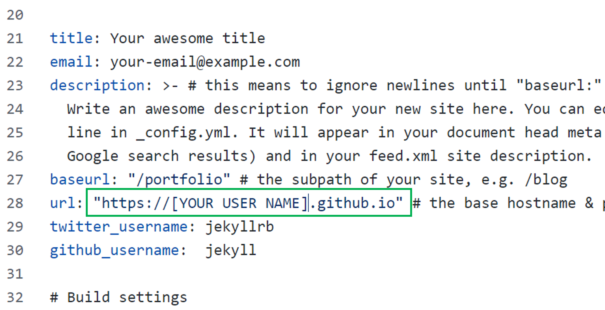
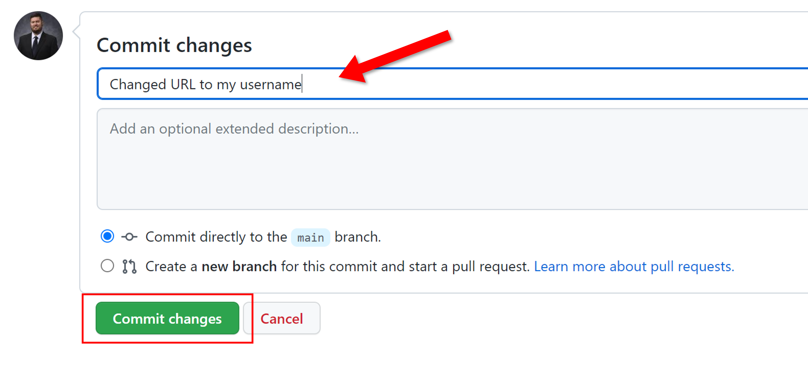
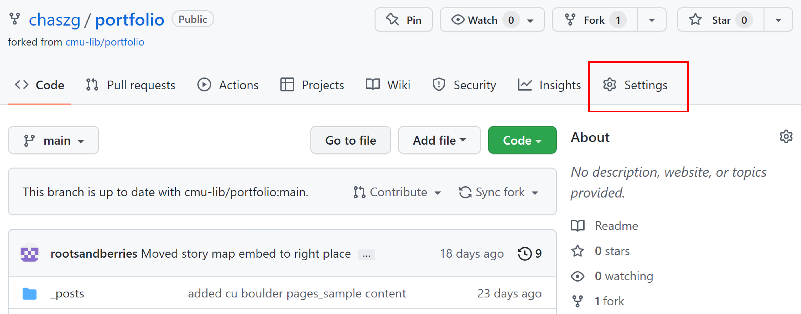
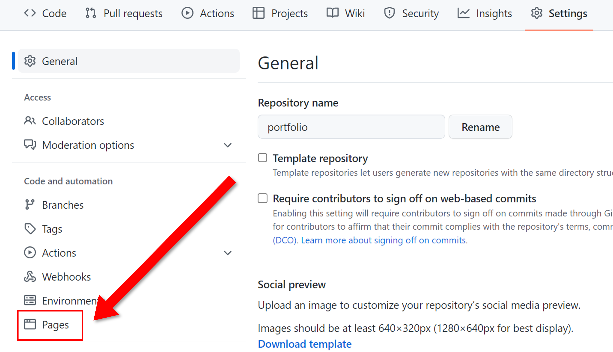
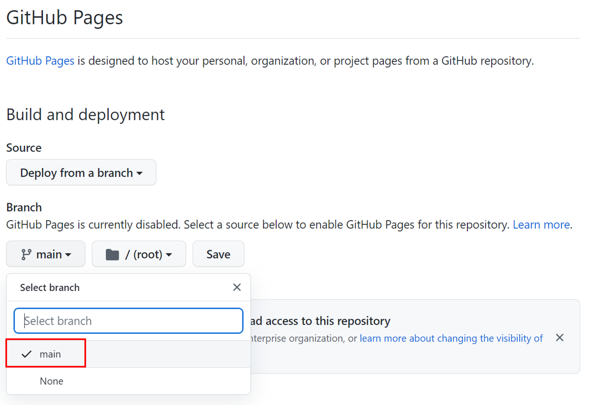
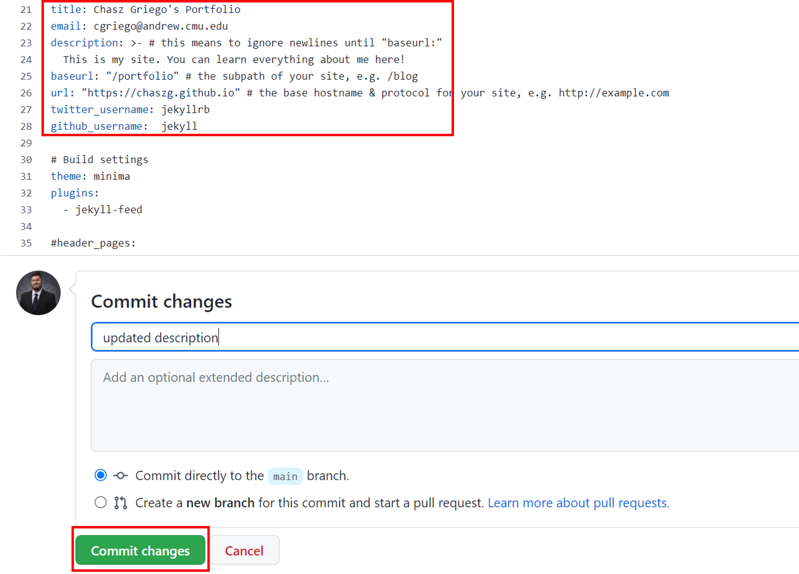

# Time to press some buttons!  

### Overview  
During this hands-on portion, you will fork a repository over to your own GitHub account, activate it as a website tied to your GitHub username, and work on adding new content and customizations.

## Fork the sample template repository  

Step 1
{: .label .label-step}
Go to [our sample portfolio repository](https://github.com/cmu-lib/portfolio)

Step 2
{: .label .label-step}
Click the Fork button to make a copy of this repository on your own GitHub account:


Head over to your account to view your fork of this repo.  

## Edit your _config.yml file  

Step 1
{: .label .label-step}
Click on the `_config.yml` file to open it.  



Step 2
{: .label .label-step}
Click the edit button.


Step 3
{: .label .label-step}
Change the url field to match your username. On line 28, change:  
`https://cmu-lib.github.io` to `https://your-user-name.github.io`
  

Step 4
{: .label .label-step}
Scroll down, add a commit message, and click Commit to save the changes:
  


## "Spin up" your site!

Step 1
{: .label .label-step}
Go to your repository Settings:


Step 2
{: .label .label-step}
Click the Pages tab at bottom left:


Step 3
{: .label .label-step}
Under source, switch the branch to main and click save:


### Your site is building! This can take up to a few minutes. Head over to: [your-user-name].github.io/pages-sample in a new browser tab to see the result.

## Playtime! Now let's work through some basic customizations

First, open up your `_config.yml` file and modify the contact info, title, and description:   


### Let's make some changes to the homepage:
Now let's make some changes to the content of the home page.

Step 1
{: .label .label-step}
Open `index.md` and click Edit.

Step 2
{: .label .label-step}
Take a minute to modify the content of the homepage. Add some [dummy text](http://fillerama.io/){:target="_blank"} and perhaps a link. Links look like this:
```
[dummy text](http://fillerama.io/)
```

### Now let's talk about Layouts:
You've figured out by now that your content pages are saved as [Markdown](https://www.markdownguide.org/cheat-sheet/){:target="_blank"} (.md) files.  

Information like the layout type, title, and navigation (if applicable) are set in the front matter of the page's markdown file.

It looks like this:
```
---
layout: default
title: Home
---
```  
The layouts available will depend on which theme you are using. For this example, we are using the default Jekyll theme, called Minima.

When GitHub builds your site, it references the theme indicated in the `_config.yml` file, which indicates which theme you are using (we will discuss themes more in a minute).

Take a look now at the [repo that contains the Minima theme](https://github.com/jekyll/minima){:target="_blank"}. Open the `_layouts` folder and you can see you have a few different layouts to choose from.

**Change the layout of your `index.md` file to `home`**  

Tread lightly here... not all themes support different layouts. Many only have one page layout: `default`
{: .note}

Open your index page in the editor and change the front matter to this:
```
---
layout: home
title: Home
---
```
Enter a commit message and click Commit. Let your site reload and few the results...

*It's changed! What is all this "Posts" stuff?*  


### Let's talk about Posts!  

Jekyll is a popular platform for blogging, and the "post" layout is fairly common across different Jekyll themes.  

In your repository, open the `_posts` folder and you can see that I've provided several example posts.  

Posts must be saved in the `_posts` folder, and they must always be formatted as `yyyy-mm-dd-title-of-post.md`. This is how they show up properly in the feed.
{: .note}

You must also set the layout as 'post' and provide the a category in the front matter, the value of which can be whatever you want. Date is also good:
```
---
layout: post
title: Something smart and academic
date: 2021-08-03
categories: science
---
```

### Adjusting Themes  

GitHub Pages supports several [Standard Themes](https://pages.github.com/themes/){:target="_blank"}

**Try changing the theme of your site to one of these standard themes.**

Open your `_config.yml` file, got to line 33 and change:
`theme: minima` to `theme: jekyll-theme-architect`

Commit the change and see what happens upon build...  

**What went wrong?**

When switching themes, pay particular attention to the layouts! You may need to check the theme repo to see if it uses the same layouts your pages or posts use (see _layouts folder). If not, you may need to change layouts of your markdown files.
{: .warn}

**Fix it** Change the layout of your `index.md` file to default.


### *2*{: .circle .circle-blue} Remote Themes  

In addition to the standard themes, you can also use "Remote Themes", of which there are hundreds.  
[GitHub Pages Remote Themes](https://github.com/topics/jekyll-theme){:target="_blank"}  

If you're relying on remote themes, your mileage may vary here! Be prepared to troubleshoot.
{: .warn}  

**Truth:** If you want to use themes beyond the standard GH Pages themes, it is best to clone a theme's repository, work on it locally, and push it to a new remote repository on your GitHub account. This will give you further control over the look and feel of your site and a lot of flexibility...

See [Advanced](../GH_Pages_Materials/GH-Pages-Advanced)
